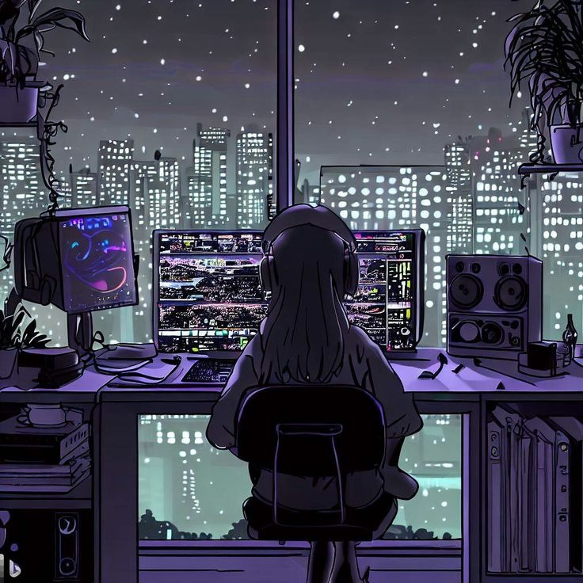

  <!-- Header Banner -->
  

  <!-- Typing Dynamic Text -->
  

    

  <!-- Social Badges -->
  
  &nbsp;
  
  &nbsp;
  
  &nbsp;
  
  &nbsp;
  

 

<!-- ==================== TECHNOLOGIES ==================== -->

  <h2>🔘 Technologies</h2>

  

    

  

    
    
    
    
    
    
    
    
  

 

<!-- ==================== STATISTICS ==================== -->

  <h2>🔘 Statistics</h2>

  

    
    
  

  

    
  

 

<!-- ==================== ABOUT ME ==================== -->

  <h2>🔘 About Me</h2>

<table align="center" border="0">
  <tr>
    <td width="35%" align="center" valign="middle">
      
    </td>
    <td width="65%" valign="middle" style="padding-left: 18px; line-height: 1.7;">
      

        Hello! My name is <b>Toqa Ibrahem Essa</b>, and I am a <b>Flutter & Mobile App Developer</b> and Computer Science Graduate based in Egypt. I am passionate about learning new technologies, developing innovative mobile projects, and solving complex problems through clean and efficient code.
      

      

        Currently, I am honing my skills in <b>Flutter, Dart, Clean Architecture, BLoC / Cubit, Firebase, and RESTful APIs</b>, focusing on building robust, high-performance, and responsive cross-platform applications while continuously growing within the tech industry.
      

    </td>
  </tr>
</table>

 

<!-- ==================== HOBBIES & GOALS ==================== -->

  <h2>🔘 Hobbies & Goals</h2>

<table align="center" border="0">
  <tr>
    <td width="78%" valign="middle" align="center">
      

        <b>Computer Science Graduate & Mobile Engineer</b> 
        <i>"Code is like humor. When you have to explain it, it's bad."</i> — <b>Cory House</b>
      

      

        🎯 <b>Mission:</b> Build impactful, seamless mobile applications that make people's lives easier. 
        💡 <b>Love:</b> Pixel-perfect UI design, smooth micro-interactions, and architecting clean state management.
      

    </td>
    <td width="22%" align="center" valign="middle">
      
    </td>
  </tr>
</table>

 

<!-- ==================== CONTRIBUTION GRAPH ==================== -->

  <h2>🐍 Contribution Graph</h2>
  

 

<!-- ==================== FOOTER ==================== -->

  

   
  <i>⚡ "Creating magic one line of code at a time!" ⚡</i>
    
  <b>Hey there! Thanks for stopping by my creative space. Feel free to connect! 💖</b>
    
  Crafted with 💜 & lots of ☕ by <b>Toqa Ibrahem Essa</b>

